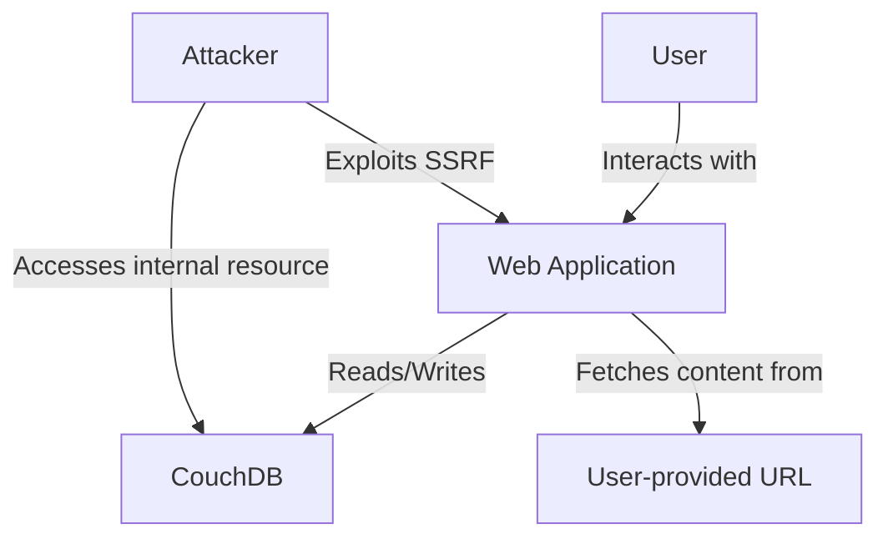

# SSRF Vulnerability Demonstration Application

This application is designed to demonstrate Server-Side Request Forgery (SSRF) vulnerabilities in web applications. It provides both secure and insecure implementations to help developers understand the risks associated with SSRF and how to mitigate them.

## Table of Contents

1. [Setup](#setup)
2. [Running the Application](#running-the-application)
3. [Interacting with the Application](#interacting-with-the-application)
4. [Secure vs. Insecure Implementations](#secure-vs-insecure-implementations)
5. [Code Explanations](#code-explanations)
6. [Security Considerations](#security-considerations)

## Setup

1. Ensure you have Docker and Docker Compose installed on your system.
2. Clone this repository to your local machine.
3. Navigate to the `ssrf-demo` directory.
4. Run `docker-compose up --build` to start the application and the associated CouchDB instance.

The application uses Docker Compose to set up two services:
- A web service running the Node.js application on port 8880
- A CouchDB instance (version 2.3.1) running on port 5984

## Architecture Overview

This application demonstrates Server-Side Request Forgery (SSRF) vulnerabilities in a simple web application setup. The main components are:

1. **Web Application**: A Node.js application using Express.js and EJS for templating.
2. **CouchDB**: A NoSQL database used to store sensitive information.
3. **Docker**: Used to containerize and manage the application and database services.

The web application allows users to sign up, log in, and view a dashboard that fetches content from a user-provided URL. The vulnerable version of the signup process allows any URL to be entered, potentially exposing internal resources.

Here's a diagram representing the main entities and their interactions:



### Components Explanation:

- **Web Application**: Handles user authentication, signup processes (both vulnerable and secure), and content fetching for the dashboard.
- **CouchDB**: Stores sensitive data, representing an internal resource that should not be directly accessible.
- **User-provided URL**: In the vulnerable version, this can be any URL, including internal resources.
- **Docker**: Provides isolated environments for the web application and CouchDB, simulating a more complex network setup.

The SSRF vulnerability is demonstrated when an attacker can provide a URL pointing to the internal CouchDB instance, allowing them to access sensitive data that should be restricted.

## Running the Application

To start the application and the associated CouchDB instance:

```bash
docker-compose up --build
```

This command will build the Docker images and start the containers. The web application will be accessible at `http://localhost:8880`.

## Interacting with the Application

The application provides the following endpoints:

- `/`: Home page with links to login and signup pages
- `/login`: Login page
- `/signup`: Vulnerable signup page
- `/secure-signup`: Secure signup page
- `/dashboard/:userId`: User dashboard (vulnerable to SSRF)
- `/couchdb-direct`: Direct CouchDB access (for demonstration purposes)
- `/init-db`: Initialize the CouchDB database with sample sensitive data

### Initializing the Database

Before demonstrating the SSRF vulnerability, you need to initialize the CouchDB database with sample sensitive data. To do this:

1. Ensure the application is running.
2. Visit `http://localhost:8880/init-db` in your browser or use a tool like curl to make a GET request to this endpoint.
3. You should see a JSON response indicating that the database was initialized successfully.

This step creates a 'sensitive_data' database in CouchDB and populates it with sample documents containing user credentials, API keys, and customer data.

### Demonstrating the SSRF Vulnerability

1. Initialize the database using the `/init-db` route as described above.
2. Visit `http://localhost:8880` in your browser.
3. Click on "Signup (Vulnerable)" to create an account using the vulnerable signup process.
4. For the "Blog URL" field, enter `http://couchdb:5984/sensitive_data/_all_docs`.
5. Complete the signup process and log in.
6. On the dashboard, you should see the sensitive data from the CouchDB instance, demonstrating the SSRF vulnerability.

### Using the Secure Version

1. Visit `http://localhost:8880` in your browser.
2. Click on "Signup (Secure)" to create an account using the secure signup process.
3. For the "Blog URL" field, enter a valid HTTPS URL (e.g., `https://example.com`).
4. Complete the signup process and log in.
5. On the dashboard, you should see the content from the provided URL, with SSRF mitigations in place.

## Secure vs. Insecure Implementations

### Insecure Signup (Vulnerable to SSRF)

The insecure signup process allows any URL to be entered and does not perform any validation or sanitization.

```typescript
router.post('/signup', async (req, res) => {
  const { username, password, blogUrl } = req.body;
  if (users.some(u => u.username === username)) {
    return res.render('signup', { error: 'Username already exists', secure: false });
  }
  const newUser: User = { id: users.length + 1, username, password, blogUrl };
  users.push(newUser);
  res.redirect('/login');
});
```

### Secure Signup (SSRF Mitigated)

The secure signup process validates the URL to ensure it uses HTTPS and is not pointing to an internal network.

```typescript
router.post('/secure-signup', async (req, res) => {
  const { username, password, blogUrl } = req.body;
  if (users.some(u => u.username === username)) {
    return res.render('signup', { error: 'Username already exists', secure: true });
  }
  
  // Validate URL
  const urlPattern = /^https:\/\/(?!192\.168\.|172\.(?:1[6-9]|2\d|3[01])\.|10\.|127\.).+$/;
  if (!urlPattern.test(blogUrl)) {
    return res.render('signup', { error: 'Invalid or insecure URL', secure: true });
  }
  
  const newUser: User = { id: users.length + 1, username, password, blogUrl };
  users.push(newUser);
  res.redirect('/login');
});
```

## Code Explanations

### Vulnerable Dashboard Route

The vulnerable dashboard route fetches content from the user-provided URL without any validation:

```typescript
router.get('/dashboard/:userId', async (req, res) => {
  const user = users.find(u => u.id === parseInt(req.params.userId));
  if (!user) {
    return res.status(404).send('User not found');
  }
  
  try {
    const response = await axios.get(user.blogUrl);
    res.render('dashboard', { user, blogContent: response.data });
  } catch (error) {
    res.render('dashboard', { user, blogContent: 'Error fetching blog content' });
  }
});
```

This implementation allows an attacker to provide any URL, including internal network addresses, potentially exposing sensitive information.

### Secure Implementation (Not Included in Demo)

A secure implementation would include URL validation and potentially use a whitelist of allowed domains:

```typescript
router.get('/dashboard/:userId', async (req, res) => {
  const user = users.find(u => u.id === parseInt(req.params.userId));
  if (!user) {
    return res.status(404).send('User not found');
  }
  
  // Validate URL
  const urlPattern = /^https:\/\/(?!192\.168\.|172\.(?:1[6-9]|2\d|3[01])\.|10\.|127\.).+$/;
  if (!urlPattern.test(user.blogUrl)) {
    return res.render('dashboard', { user, blogContent: 'Invalid or insecure URL' });
  }
  
  try {
    const response = await axios.get(user.blogUrl);
    res.render('dashboard', { user, blogContent: response.data });
  } catch (error) {
    res.render('dashboard', { user, blogContent: 'Error fetching blog content' });
  }
});
```

## Security Considerations

- Always validate and sanitize user input, especially when it's used in server-side requests.
- Use a whitelist of allowed domains or IP ranges when making external requests.
- Implement network segmentation to isolate sensitive internal services.
- Use HTTPS for all external requests to prevent man-in-the-middle attacks.
- Consider using a URL parsing library to validate URLs and their components.
- Implement proper access controls and authentication mechanisms.

Remember, this application is for educational purposes only and should not be used in a production environment. Always follow security best practices and consult with security professionals when building real-world applications.